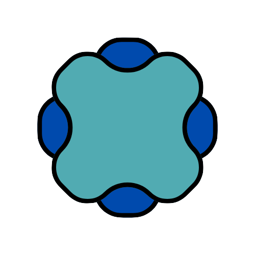

<div align="center">
  
  <h1>Giovanni Battista Pernazza</h1>
  <p>Modern Portfolio & Digital Garden 🌱</p>

  <p>
    <a href="https://nannipy.vercel.app">View Demo</a>
    ·
    <a href="https://github.com/nannipy/nannipy/issues">Report Bug</a>
    ·
    <a href="https://github.com/nannipy/nannipy/issues">Request Feature</a>
  </p>

  
  
  
</div>

---

## ✨ About

A cutting-edge portfolio built with Next.js and TypeScript, featuring smooth animations and a terminal-style interface. Experience a perfect blend of modern design and interactive elements.

### 🎯 Key Highlights

- 🖥️ **Terminal Experience** - Immersive typing animations
- 🎨 **Modern Design** - Clean, minimal, and responsive
- ⚡ **Lightning Fast** - Optimized for performance
- 🌙 **Dark Mode** - Easy on the eyes
- 📱 **Fully Responsive** - Perfect on all devices

## 🛠️ Built With

<div align="center">

[](https://nextjs.org/)
[](https://www.typescriptlang.org/)
[](https://reactjs.org/)
[](https://tailwindcss.com/)
[](https://vercel.com)

</div>

## 🗂️ Project Structure

```bash
src/
├── 📱 app/           # Next.js app router
├── 🧩 components/    # Reusable components
├── 📚 lib/          # Data & utilities
├── 🎨 styles/       # Global styles
└── 📝 types/        # TypeScript types
```

## 🚀 Quick Start

### Prerequisites

```bash
node -v >= 14.0.0
```

### Installation

1️⃣ Clone & Install:
```bash
git clone https://github.com/nannipy/nannipy.git && cd nannipy && npm install
```

2️⃣ Start developing:
```bash
npm run dev
```

3️⃣ View at: [http://localhost:3000](http://localhost:3000) 🎉

## 📋 Available Commands

```bash
npm run dev      # Start development server
npm run build    # Build for production
npm run start    # Start production server
npm run lint     # Check code quality
```

## 🤝 Contributing

1. 🔱 Fork it
2. 🌿 Create your branch (`git checkout -b feature/AmazingFeature`)
3. 💫 Commit changes (`git commit -m 'Add AmazingFeature'`)
4. 🚀 Push (`git push origin feature/AmazingFeature`)
5. 🎉 Open a PR

## 📌 Roadmap

- [ ] 🧪 Unit testing implementation
- [ ] 📝 Blog section
- [ ] 🌐 Internationalization
- [ ] ♿ Accessibility improvements
- [ ] 🌓 Theme switcher

## 👤 Connect

<div align="center">

[](mailto:gb.pernazza@gmail.com)
[](https://www.linkedin.com/in/giovannibpernazza)
[](https://github.com/nannipy)

</div>

## 📄 License

Released under the MIT License. See `LICENSE` for more information.


<div align="center">
  <sub>Built with ❤️ by Giovanni Battista Pernazza</sub>
</div>
